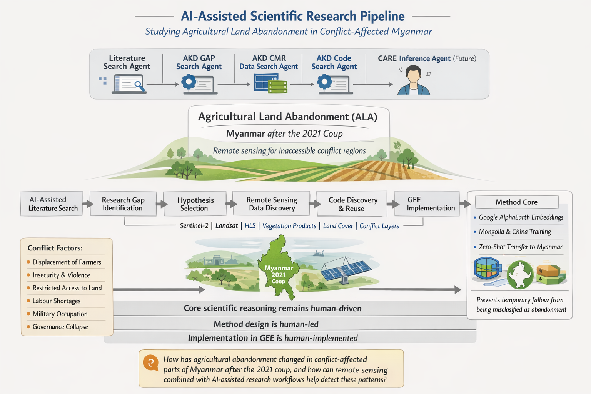

# 🌾🤖 AI Agentic Tool Use for Research work

## Studying Agricultural Abandonment in Conflict-Affected Myanmar

An **AI-assisted scientific research pipeline** for studying **Agricultural Land Abandonment (ALA)** in **conflict-affected regions**, beginning with **Myanmar after the 2021 military coup**.

This project explores how **AI agents, remote sensing, and human scientific reasoning** can work together in a **reproducible research workflow**.

---

# 🧠 AI-Agentic Research Workflow

This repository connects the entire scientific workflow:

```
Literature → Research Gaps → Hypotheses → Data → Code → Analysis → Scientific Output
```

The repository is organized around **specialized AI agents**, each responsible for a stage of the research process.

However, **core scientific reasoning and implementation remain human-driven**.

---

# ⚙️ End-to-End Research Pipeline

This repository is designed to move through the following stages:

1️⃣ **AI-assisted literature search**
*(Best available AI literature retrieval tools)*

2️⃣ **Research gap identification**
*(AKD GAP Agent)*

3️⃣ **Hypothesis selection**
*(AKD GAP Agent + Human decision)*

4️⃣ **Code discovery and reuse**
*(AKD Code Search Agent)*

5️⃣**Method design**
*(Human-designed scientific methodology)*

6️⃣ **Remote sensing data discovery**
*(AKD CMR Data Search Agent)*

7️⃣ **Implementation in Google Earth Engine (GEE)**
*(Currently being implemented by Human)*

8️⃣ **Inference reasoning (CARE framework)**
*(Future AI agent)*

9️⃣ **Paper writing**

🔟 **Scientific illustrations** [By AKD- Illustration Agent]]

1️⃣1️⃣ **Paper review**

1️⃣2️⃣ **Paper submission**

---

# 🌍 Project Motivation

Scientific Illustration using [AKD-Illustration Agent V2 ](https://github.com/NASA-IMPACT/AKD-Scientific-Illustration-Agent/blob/main/Version2/Readme_v2.md)

<p align="center">

&nbsp;

Agricultural abandonment is often studied in relation to:

* 📉 economic change
* 🌱 land-use transitions
* 🚶 migration
* 🌿 environmental recovery

However, **conflict-driven agricultural abandonment remains poorly quantified**.

In conflict zones, abandonment may result from:

* displacement of farmers
* insecurity and violence
* restricted access to land
* labour shortages
* military occupation
* governance collapse

Myanmar after the **2021 coup** provides a critical case for studying how **conflict reshapes agricultural land use**.

Remote sensing offers a way to **monitor agricultural change even when field access is impossible**.

---

# 🎯 Core Research Theme

**Topic:** Agricultural Land Abandonment (ALA)
**Context:** Conflict-affected regions
**Initial Case Study:** Myanmar after the 2021 coup

---

## 🔎 Core Research Question

> **How has agricultural abandonment changed in conflict-affected parts of Myanmar after the 2021 coup, and how can remote sensing combined with AI-assisted research workflows help detect these patterns?**

---

# 🤖 AI Agent Pipeline

This repository contains **multiple research agents**, each performing a specific task.

The workflow integrates **AI automation with human scientific design**.

---

# 📚 1. Literature Search Agent

🔗 Benchmark repository
[https://github.com/nidhi23aug/Lit-Search-Tool-Comparison](https://github.com/nidhi23aug/Lit-Search-Tool-Comparison)

📂 Documentation

```
Agents/LitSearchAgent_Use/LitSearch_Using_Google_Labs.md
```
[LitSearch Using Google Lab](Agents/LitSearchAgent_Use/LitSearch_Using_Google_Labs.md) 

### 🎯 Purpose

Identify and evaluate the **best AI-assisted literature retrieval tools**.

### 🧠 Tasks

* Benchmark AI literature search tools
* Generate structured research queries
* Retrieve relevant papers
* Compare retrieval quality
* Select a working corpus of papers

### 📥 Input

* research prompts
* AI literature retrieval tools
* structured query templates

### 📤 Output

* curated paper list
* literature summaries
* bibliography
* search logs

### 📄 Example Paper Set

| ID  | Paper                                          |
| --- | ---------------------------------------------- |
| P11 | Crawford et al. 2022 – abandonment persistence |
| P2  | Prishchepov et al. 2025 – RS methods review    |
| P6  | Liu et al. 2025 – abandonment typology         |
| P3  | Goga et al. 2019 – definitions and validation  |
| P8  | Yusoff & Muharam 2015 – phenology detection    |
| P9  | Yusoff et al. 2017 – SAR detection             |
| P7  | Long et al. 2024 – abandonment intensity       |
| P8b | Yin et al. 2018 – Landsat segmentation         |
| P10 | Orontes Basin conflict LULC                    |

---

# 🧩 2. AKD GAP Search Agent

📂 Directory

```
Agents/GapAgents/
```

📄 Documentation

* [Gap Agent NJ](Agents/GapAgents/GapAgent_AKD_NJ.md)
* [Gap Agent Sid](Agents/GapAgents/Gap_Gemini_Sid.md)

### 🎯 Purpose

Analyze the literature corpus and identify **research gaps**.

### 🔍 Focus Areas

* abandonment during active conflict
* post-coup agricultural change in Myanmar
* remote sensing indicators of forced abandonment
* validation challenges in inaccessible regions

### 📤 Outputs

* research gap map
* candidate research questions
* possible hypotheses
* suggested methods

---

# 🧪 3. Hypothesis Development

### 🎯 Purpose

Define a **testable research hypothesis** based on identified gaps.

### Example Research Questions

**RQ1**

What is the spatiotemporal pattern of cropland abandonment and recultivation in Myanmar after the 2021 coup?

**Hypotheses**

H₀ — No detectable change in abandonment rates.

H₁ — Abandonment patterns change with conflict escalation.

---

**RQ2**

How long does conflict-related abandonment persist?

H₀ — Persistence patterns are similar to non-conflict regions.

H₁ — Persistence differs in conflict-affected areas.

---

### Possible Methods

* optical time-series analysis
* change-point detection
* crop activity proxies
* conflict-exposure stratification
* weakly supervised classification

---

# 💻 4. AKD Code Search Agent- Existing Code 

[Code Search Documentation](https://github.com/nidhi23aug/Usecase-AI-Agents-Mynamar-Conflict-Research/blob/main/Agents/CodeSearch/CodeSearchAgent.md)

### 🎯 Purpose

Identify reusable code for:
* cropland persistence detection
* abandonment mapping
* time-series change detection
* SAR-optical fusion
* conflict-sensitive geospatial analysis

### 📤 Outputs

* reusable code inventory
* adaptation plan
* implementation notes
* risk assessment

## 📦 Repository Resources for the Workflow

| Rank | Initial Repository Searches (Foundation Models / Geospatial ML) | Repository (When Moving to Google Earth Engine) | When Used / Decision Context |
|-----:|---------------------------------------------------------------|------------------------------------------------|------------------------------|
| 1 | **NASA-IMPACT / Prithvi-EO-2.0**  <br> https://github.com/NASA-IMPACT/Prithvi-EO-2.0 | **google / earthengine-community** <br> https://github.com/google/earthengine-community | When switching to **Earth Engine tutorials and runnable examples**, including Satellite Embedding (AlphaEarth) workflows |
| 2 | **NASA-IMPACT / hls-foundation-os** <br> https://github.com/NASA-IMPACT/hls-foundation-os | **google / earthengine-api** <br> https://github.com/google/earthengine-api | When using **official Python/JavaScript bindings** to access Earth Engine datasets and APIs |
| 3 | **microsoft / torchgeo** <br> https://github.com/microsoft/torchgeo | **google / Xee** <br> https://github.com/google/Xee | When integrating **Earth Engine outputs with Xarray-based analysis workflows** |
| 4 | **nasaharvest / cropharvest** <br> https://github.com/nasaharvest/cropharvest | **gee-community / geemap** <br> https://github.com/gee-community/geemap | When building **interactive Earth Engine workflows in Python notebooks** |
| 5 | **nasa-nccs-hpda / ilab-pangaea-bench** <br> https://github.com/nasa-nccs-hpda/ilab-pangaea-bench | **giswqs / earthengine-py-notebooks** <br> https://github.com/giswqs/earthengine-py-notebooks | When adapting **Earth Engine Python examples for geospatial analysis pipelines** |
| 6 | **janne-alatalo / sar-change-detection** <br> https://github.com/janne-alatalo/sar-change-detection | **Brayden-Zhang / alphaearth-foundations** <br> https://github.com/Brayden-Zhang/alphaearth-foundations | When exploring **AlphaEarth Foundations satellite embeddings and related resources** |

---

## ⚠️ Implementation Decision: Why Google Earth Engine (GEE)?

During the initial exploration phase, several repositories and workflows related to **geospatial foundation models (FM)** were evaluated, including Prithvi-EO and other Earth observation ML frameworks.

However, the current implementation was moved to **Google Earth Engine (GEE)** for the following reasons:

- **Limited practical experience with foundation model pipelines** for Earth observation at this stage of the project.
- **Higher implementation complexity** when working with large-scale FM frameworks that require extensive infrastructure, training pipelines, and dataset preparation.
- **Ease of implementation and reproducibility** in Google Earth Engine, which already provides:
  - global satellite data access  
  - built-in geospatial processing tools  
  - scalable computation  
  - rapid prototyping for remote sensing workflows.

Because of these practical considerations, **Google Earth Engine was chosen as the primary implementation environment for the current stage of the project**.

---

# 🧑‍🔬 5. Human-Led Method Design

⚠️ **This stage is designed and implemented by human researchers.**

Agents assist with discovery, but **scientific methodology remains human-driven**.

---

### 🛰 Representation of Landscape Structure

High-dimensional **Google AlphaEarth embeddings** represent landscape structure in satellite imagery.

These embeddings provide a **generalized representation of land-surface signals**.

---

### 🤖 Cross-Regional Machine Learning Transfer

A supervised machine learning model is trained using **labeled abandonment samples from Mongolia and China**.

The model is transferred to Myanmar using **zero-shot cross-regional inference**.

This enables analysis in **data-scarce regions without retraining**.

---

### 🌱 Persistence-Based Definition of Abandonment

Agricultural land is classified as abandoned only if **uncultivated for three consecutive years**.

This definition aligns with:

* remote-sensing literature
* land governance policies
* national guidelines such as Malaysia's **3-year abandonment rule**

This prevents **temporary fallow from being misclassified as abandonment**.

---

# 🛰 6. AKD CMR Data Search Agent

📄 Documentation

[DataSearch](Agents/DataSearch/DataSearch.md)
### 🎯 Purpose

Identify **Earth observation datasets** relevant to the research hypothesis.

### Potential Data Sources

* Sentinel-2
* Landsat
* HLS
* vegetation products
* land cover datasets
* conflict exposure layers

### 📤 Outputs

* dataset inventory
* temporal coverage summary
* spatial suitability notes
* access instructions

## 📊 Tabular Summary (≥2 datasets)

| Rank | Short Name                      | Concept ID        | Optical?                | 10 m Resolution? | Temporal Coverage          | Primary Metadata Mismatch        |
|-----:|---------------------------------|------------------|-------------------------|------------------|-----------------------------|----------------------------------|
| 1 | TerraScope Sentinel-2 L1C | C2207478568-FEDEO | Yes | Yes (10/20/60 m) | 2015-07-06 → 2021-12-31 | Does not reach 2025 |
| 2 | TerraScope Sentinel-2 L2A TOC | C2207478523-FEDEO | Yes | Not explicit | 2015-07-06 → 2021-12-31 | 10 m not explicit |
| 3 | ESA WorldCover 2020 | C2655129129-FEDEO | Derived optical | Yes | Placeholder 1970 (actual 2020) | Single-year map |
| 4 | ESA WorldCover 2021 | C2655129178-FEDEO | Derived optical | Yes | Placeholder 1970 (actual 2021) | Single-year map |
| 5 | WorldCover NDVI 2020 | C2770608964-FEDEO | Optical-derived | Yes | Placeholder 1970 | Single-year composite |
| 6 | WorldCover NDVI 2021 | C2655128870-FEDEO | Optical-derived | Yes | Placeholder 1970 | Single-year composite |
| 7 | WorldCereal Active Cropland | C2734302030-FEDEO | Derived cropland product | Not stated | Placeholder 1970 | Temporal span not specified |
| 8 | Sentinel-2 L2A COG (INPE) | C3108204483-INPE | Yes | Not stated | 2019-01-10 → 2025-06-25 | Brazil-only |
| 9 | Sentinel-2 L2A 16-Day Cube | C3108204485-INPE | Yes | Yes | 2017-01-01 → 2025-06-09 | Brazil-only |


---

# 🌐 7. Google Earth Engine Implementation

### *(Human-Implemented Stage)*

👨‍💻 **Lead Implementation**

**Zaw Thu Htet (Toby)**
Istituto Universitario di Studi Superiori
Pavia, Italy

All geospatial analysis is implemented using **Google Earth Engine (GEE)**.

### Workflow

* satellite data preparation
* embedding generation
* machine-learning inference
* temporal persistence analysis
* cropland classification refinement
* spatial mapping and statistics

Goal: produce a **reproducible high-resolution agricultural abandonment analysis pipeline**.

---

# 🧠 8. CARE Inference Agent *(Future)*

### 🎯 Purpose

Move beyond detection toward **causal inference and reasoning**.

Possible capabilities:

* evidence synthesis
* uncertainty estimation
* explanation generation
* hypothesis evaluation

Status: **conceptual / exploratory**

---

# 🇲🇲 Case Study: Myanmar After the 2021 Coup

Myanmar is chosen because it combines:

* ⚡ rapid political rupture
* 🔥 spatially heterogeneous conflict
* 🚜 agricultural disruption
* 🚧 limited field access
* 🛰 strong need for satellite monitoring

This makes Myanmar a **scientifically challenging and important case study**.

---

# 🎯 Initial Research Goals

1️⃣ Build an AI-assisted literature discovery workflow
2️⃣ Construct a focused abandonment research corpus
3️⃣ Identify research gaps using AI agents
4️⃣ Convert gaps into remote-sensing hypotheses
5️⃣ Identify suitable Earth observation datasets
6️⃣ Locate reusable geospatial code
7️⃣ Implement the analysis in Google Earth Engine
8️⃣ Document uncertainty and limitations

---

# 📂 Repository Structure

```
Agents/
│
├── DataSearch/
│   └── DataSearch.md
│
├── GapAgents/
│   ├── GapAgent_AKD_NJ.md
│   └── Gap_Gemini_Sid.md
│
├── LitSearchAgent_Use/
│   ├── LitSearch Using Google Labs.md
│   ├── list-of-articles-sid.md
│   └── test.md
│
README.md
```

---

# 🚀 Long-Term Vision

This project explores how **AI agents can augment scientific research workflows** by assisting with:

* literature exploration 📚
* gap discovery 🔍
* dataset identification 🛰
* code reuse 💻
* workflow automation ⚙️

The goal is **not to replace scientists**, but to create **AI-assisted research pipelines that accelerate discovery while keeping humans in the loop**.

---
